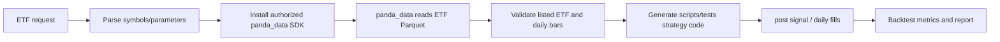

# Listed ETF Strategy Backtest Skill

[中文](README.md) | English

This skill uses `panda_data 0.1.0` and local Parquet to generate and run time-series or cross-sectional strategy backtests for listed ETFs. It does not perform factor analysis and never uses minute bars.

Original contributor: cuijie0317. QUANTSKILLS publication maintainer: abgyjaguo. This community project does not claim official certification or endorsement.

## Flow

```text
request -> install an authorized panda_data SDK -> .env -> panda_data reads local Parquet
-> validate listed ETF universe -> generate scripts/tests code -> backtest -> report
```

`panda_data 0.1.0` is the required access layer for local ETF Parquet; do not bypass the SDK by scanning files directly. Stop after the first non-empty, contract-compliant query, request only needed symbols/dates/fields, and reuse the same DataFrame throughout the task.

## Setup and data contract

Use Python 3.12. Obtain and install the authorized `panda_data 0.1.0` SDK before accessing local Parquet; this repository does not redistribute that third-party SDK. Then copy `.env.example` to `.env` and set `PARQUET_ROOT_PATH`. Keep real paths, data, credentials, and reports out of Git. A UNC path is safer than a mapped drive across Agent sessions.

Daily data should contain `date, symbol, open, high, low, close, volume`. Build the universe with `get_fund_detail(etf_lof_type="ETF", status="L")` and keep listed ETFs only.

## Price policy

- Signals: `get_fund_daily_post` (post-adjusted prices).
- Fills and portfolio valuation: `get_fund_daily` (unadjusted market prices), with execution timing stated.
- Fees and slippage are explicit parameters.
- `get_fund_etf_min` and all minute data are forbidden for backtests.

## Strategies and generation

Time-series strategies include MA, momentum, RSI, Bollinger, breakout, and stop rules. Cross-sectional strategies rank multiple ETFs, select Top-N, assign weights, and rebalance periodically. “ETF MA strategy” is a request pattern, not hard-coded behavior: generate a new Python file under `scripts/tests/` from the actual parameters, then run it.

When parameters are omitted, proceed with reproducible defaults instead of blocking: 5/20-day MA, rebalance every 5 trading days, latest two available years, 1,000,000 initial capital, and zero fee/slippage. Disclose these defaults. A signal formed after day t close can only fill on t+1, defaulting to t+1 open, to prevent look-ahead.

## Output contract

Return the universe, rules, signal/fill policy, date range, capital, costs, rebalance frequency, turnover, trade count, total and annualized return, maximum drawdown, Sharpe, final equity, data coverage, and conclusion. For failures, state the exact path/API/field/logic cause and a repair action; never invent metrics.

See `references/strategy_codegen_assistant.md`, `references/panda_data_etf_whitelist.md`, `references/research_rules.md`, and `references/output_contract.md`.

## Production Pipeline



## Problem Solved

Converts natural-language ETF rules into executable time-series or cross-sectional backtests with consistent listed-ETF universe, adjusted signals, unadjusted fills, costs, and reporting.

## Input Data Requirements

Daily data must include `date, symbol, open, high, low, close, volume`. Symbols must come from `get_fund_detail(etf_lof_type="ETF", status="L")`. Minute bars, non-ETF funds, and stocks are unsupported.

## Generated Strategy Structure

```text
parameters -> loader -> signal(post-adjusted) -> execution(daily)
            -> positions/fees/slippage -> equity curve -> metrics
```

Generate a new Python file under `scripts/tests/` for every request; do not hard-code one strategy in the skill.

## Validation Metrics

Report coverage, trading days, total and annualized return, maximum drawdown, Sharpe, trade count, turnover, cost/slippage impact, final equity, and a trade summary.

## Install in an Agent Environment

Copy the directory into the Agent skills directory. In Python 3.12 obtain and install the authorized `panda_data 0.1.0` SDK, then install the public dependencies from `requirements.txt`; copy `.env.example` to `.env` and set the Parquet path.

## Repository Contents

`SKILL.md`, bilingual READMEs, `references/` contracts and whitelist, `scripts/` runtime checks and examples, `test_etf/` debug samples, and `agents/openai.yaml`.

## License

GPL-3.0-only. Backtest results are for research and are not investment advice. The `panda_data` SDK is not included in this repository or license.

## PandaAI / QUANTSKILLS Community

PandaAI / QUANTSKILLS community: <https://github.com/quantskills>.
