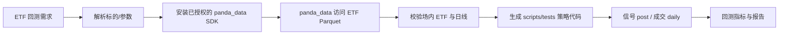

# 场内 ETF 策略回测 Skill

[English](README.en.md) | 中文

本 Skill 使用 `panda_data 0.1.0` 与本地 Parquet，按用户描述自动生成并执行场内 ETF 的时序或截面策略回测。它只做策略回测，不做因子分析，不使用分钟线。

原始贡献者：cuijie0317；QUANTSKILLS 发布维护：abgyjaguo。社区项目，未声明官方认证或推荐。

## 核心流程

```text
需求解析 -> 安装已授权的 panda_data SDK -> 读取 .env -> panda_data 访问本地 Parquet
-> ETF 池校验 -> 生成 scripts/tests/策略代码 -> 回测 -> 指标与可信度
```

`panda_data 0.1.0` 是本地 ETF Parquet 的必经访问层，不能绕过 SDK 直接扫描文件。找到非空且字段完整的数据后立即停止，不重复探测或逐代码串行查询；相同查询在一次任务中复用同一个 DataFrame。

## 环境与数据

要求 Python 3.12。必须先从获得授权的来源安装并成功导入 `panda_data 0.1.0`；本仓库不分发该第三方 SDK。然后复制 `.env.example` 为 `.env` 并设置 `PARQUET_ROOT_PATH`。真实路径、数据文件和凭据必须加入 `.gitignore`；网络盘在当前 Agent 会话不可见时应使用可访问的 UNC 路径。

行情至少需要 `date, symbol, open, high, low, close, volume`。ETF 池通过 `get_fund_detail(etf_lof_type="ETF", status="L")` 获取，只保留场内 ETF。

## 价格口径

- 信号：`get_fund_daily_post` 后复权价格，避免分红和拆分产生假信号。
- 成交与净值：`get_fund_daily` 未复权价格；明确收盘、次日开盘或下一可交易点。
- 费用和滑点：由用户参数决定；未给出时使用代码中的透明默认值并披露。
- 禁止用 `get_fund_etf_min` 或任何分钟线做回测。

## 支持策略

时序策略包括单 ETF 均线、动量、RSI、布林带、突破和止盈止损。截面策略包括多 ETF 的收益/波动/趋势打分、排名、Top-N、权重分配和定期调仓。Agent 不应把“ETF 均线策略”写死，而应根据用户参数生成独立 Python 文件到 `scripts/tests/` 后执行。

未指定参数时不会停在追问：默认 5/20 日均线、每 5 个交易日调仓、最近两年、100 万初始资金、零费率零滑点；这些默认值必须在结果中披露。信号在 t 日收盘计算，最早 t+1 日开盘成交，避免未来函数。

## 快速使用

```text
参考 skill-backtest-etf，使用 .env 的本地 Parquet，回测场内 ETF 510050.SH
的 5/20 日均线金叉死叉，使用可用数据最近两年，返回完整回测指标。
```

```powershell
python scripts/check_runtime.py
python scripts/tests/<generated_strategy>.py
```

## 输出契约

必须返回：标的/ETF 池、策略规则、信号与成交口径、区间、初始资金、费用/滑点、调仓频率、换手率、交易次数、总收益、年化收益、最大回撤、Sharpe、最终净值、数据行数和结论。数据为空、字段缺失或策略代码失败时，返回具体根因和下一步修复，不伪造结果。

## 目录

| 路径 | 用途 |
|---|---|
| `SKILL.md` | Agent 的短入口和强制规则 |
| `references/strategy_codegen_assistant.md` | 策略代码生成规则 |
| `references/panda_data_etf_whitelist.md` | ETF 数据 API 白名单 |
| `references/research_rules.md` | 价格、成交和成本规则 |
| `references/output_contract.md` | 回测输出规范 |
| `scripts/` | 环境检查与回测执行代码 |
| `scripts/tests/` | Agent 新生成的策略代码和本地样例 |

本 Skill 仅用于研究与验证，输出不构成投资建议。

## 生产流水线



## 这个 Skill 解决什么问题

把自然语言 ETF 策略转成可执行的时序或截面回测，统一场内 ETF 股票池、复权信号、未复权成交、成本和结果输出口径。

## 输入数据要求

日线至少包含 `date, symbol, open, high, low, close, volume`；标的必须来自 `get_fund_detail(etf_lof_type="ETF", status="L")`。不接受分钟线，不接受非 ETF 基金或股票。

## 生成出来的策略结构

```text
参数 -> 数据加载 -> signal(post-adjusted) -> execution(daily)
      -> positions/fees/slippage -> equity_curve -> metrics
```

每次请求生成独立 Python 文件到 `scripts/tests/`，不能把均线或其他策略写死在 Skill 中。

## 验证指标

区间覆盖、交易日数、总收益、年化收益、最大回撤、Sharpe、交易次数、换手率、费用/滑点影响、最终净值和交易明细摘要。

## 安装到智能体环境

将目录复制到 Agent skills 目录，在 Python 3.12 从获得授权的来源安装 `panda_data 0.1.0`，再安装 `requirements.txt` 中的公开依赖；复制 `.env.example` 为 `.env` 并设置 Parquet 路径。

## 仓库内容

`SKILL.md`、中英文 README、`references/`（白名单、回测规则、输出契约）、`scripts/`（运行时检查和示例）、`test_etf/`（调试样例）、`agents/openai.yaml`。

## License

GPL-3.0-only。回测结果仅供研究，不构成投资建议。`panda_data` SDK 不包含在本许可证或本仓库中。

## PandaAI / QUANTSKILLS 社群

PandaAI / QUANTSKILLS 社群：<https://github.com/quantskills>。
